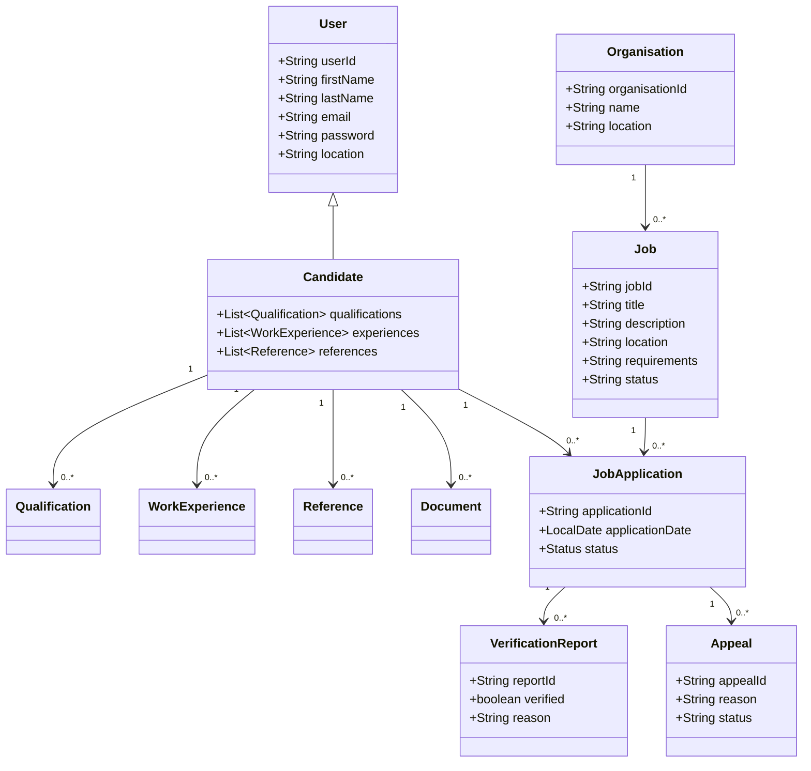

# 5. UML Diagram

The following conceptual class diagram represents the main relationships in VerifyHire.



## Architectural Component View

```text
+----------------------+
| Browser / API Client |
+----------+-----------+
           |
           v
+----------------------+
| Spring Boot REST API |
|    Controllers       |
+----------+-----------+
           |
           v
+----------------------+
|      Services        |
+----------+-----------+
           |
           v
+----------------------+
| CandidateRepository  |
|    JDBC / Repos      |
+----------+-----------+
           |
           v
+----------------------+
|     PostgreSQL       |
+----------------------+
```
